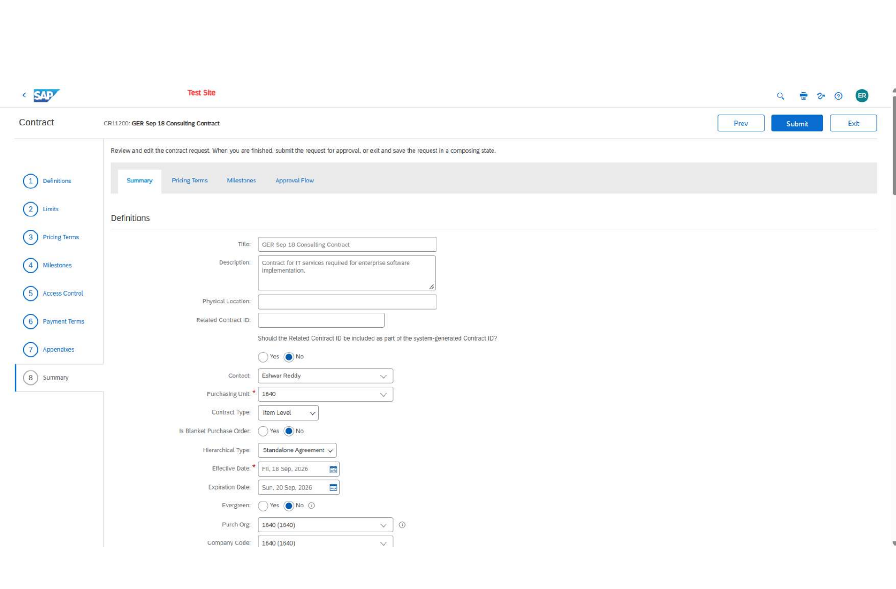
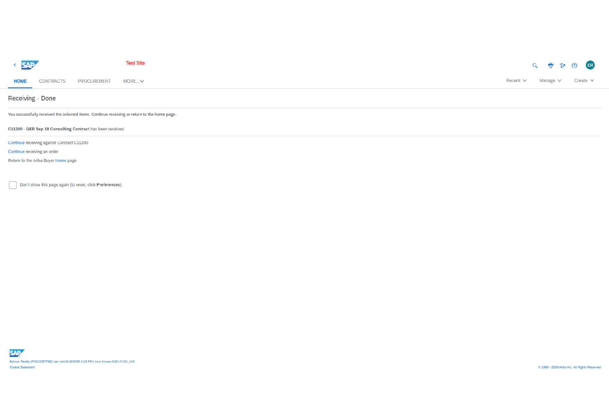

# SAP Ariba Service Contract, Receiving & Lifecycle Controls

**SAP Ariba Live Access | Sep 2026**

Hands-on Procure-to-Pay case study focused on **no-release service contracts, receiving, milestone controls and contract lifecycle changes**.

## Results

| Control / transaction | Result |
|---|---:|
| Contract ceiling | **USD 500,000** |
| Overall tolerance | **3%** |
| Consultant rate | **USD 250/hour** |
| Quantity ceiling | **1,000 hours** |
| Service receipt | **60 hours = USD 15,000 at contract rate** |
| Lodging control | **USD 20,000 + 10% tolerance** |
| Food control | **USD 10,000 + 10% tolerance** |
| Milestone verified | **USD 10,000** |
| Lifecycle amendment | **USD 10,000 minimum commitment** |

## What I built

- Configured a **standalone item-level service contract** with invoicing and receiving enabled and **no release requirement**.
- Established consultant pricing at **USD 250/hour**, a 1,000-hour limit and 10% quantity tolerance.
- Added lodging and food spend controls to limit non-labor exposure.
- Created and verified a **USD 10,000 project milestone**.
- Submitted a **60-hour service receipt**, representing **USD 15,000** at the contracted rate, and completed the receiving flow.
- Closed the related supplier agreement, created a change version and added a **USD 10,000 minimum commitment**.

## Evidence

### Service pricing and limits

### Milestone controls

### Contract and pricing review

### Service receiving

## Skills demonstrated

**SAP Ariba Contract Compliance · Service Procurement · Receiving · Limits & Tolerances · Milestones · Contract Close-out · Amendments · Versioning · Compliance Controls**

## Business relevance

The project demonstrates the operational controls required to move a service agreement from contract setup through receipt confirmation and lifecycle maintenance while preserving pricing, quantity and compliance limits.

## Scope

Executed in an SAP Ariba learning/test environment. No production client data is included.
